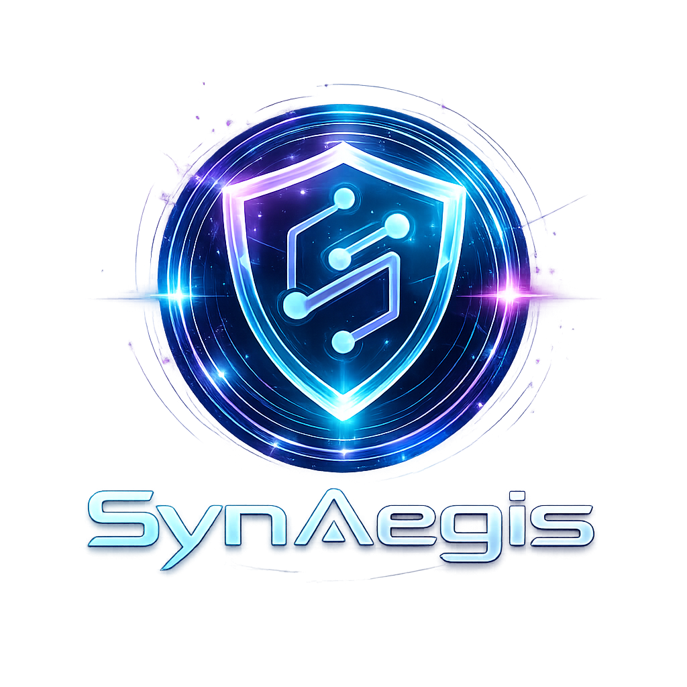

<p align="center">
  
</p>

# SynAegis
**The AI-Powered Real-Time DevOps, Security, and Cloud Command Center.**

SynAegis is a high-performance, real-time multimodal agent platform that completely redefines the modern command center. It unifies CI/CD pipelines, cloud infrastructure telemetry, and security threat response into a single pane of glass—driven by a voice-controlled AI that acts autonomously to solve complex infrastructure problems before they escalate.

### The Problem
Modern DevOps, Cloud environments, and SecOps teams suffer from severe tool-sprawl. Critical data lives in siloed dashboards, incident response takes too long, and context is lost switching between Jira, GitLab, AWS, and Datadog. 

### The Solution: SynAegis
We eliminate the silos. SynAegis introduces an autonomous AI agent capable of holding real-time multimodal (audio/vision/text) conversations while possessing God-mode access to your CI/CD pipelines, cloud nodes, and security network. It doesn't just read metrics—it writes fixes, patches vulnerabilities, and executes deployments at the speed of thought.

---

## 🚀 Key Features

### 1. 🧠 AI War Room
- **Real-Time Multimodal Voice Agent:** Talk directly to the system. It listens in real-time and responds intelligently.
- **Context-Aware Execution:** The agent dynamically selects tools (GitLab pipelines, AWS node management, threat blacklisting) based on user commands.
- **Multimodal Feedback:** Visual orb state transitions (idle, listening, thinking, speaking) alongside live transcription protocols.

### 2. ⚙️ CI/CD Pipeline Dashboard
- **Live Pipeline Telemetry:** Monitor every stage of your GitLab deployments in real-time.
- **AI-Powered Code Patching:** If a build fails, click "Apply Patch" to let the AI analyze the error, rewrite the code, and commit directly to the repo.
- **Real GitLab Integration:** Deep synchronization via GitLab tokens to manage real-world commits and merge requests.

### 3. ☁️ Cloud Infrastructure Dashboard
- **Node & Cluster Monitoring:** A centralized HUD for visualizing active nodes, resource utilization, and health metrics.
- **Dynamic Scale Control:** Spin instances up or down seamlessly via direct UI clicks or AI prompts.
- **Real-Time Telemetry:** Recharts-powered interactive graphs mapped dynamically to the backend data stream.

### 4. 🔐 Security Dashboard
- **Live Threat Feed:** Instantly visualizes network anomalies, unauthorized access attempts, and DDOS metrics.
- **AI Threat Advisor:** Automated post-mortems of security breaches with proactive architectural recommendations.
- **Active Defense Protocols:** Directly block IPs or revoke comprised tokens with one click.

### 5. 🛠 Settings & Integrations
- **Dynamic Integration Key Vault:** Securely map GitLab and Google AI configurations on the fly.
- **Custom Agent Avatars:** Upload and persist custom UI aesthetics.
- **Full Fallback Readiness:** Adjust model latency tiers and video payload limits to prevent quota bursts.

### 6. 📡 Sub-Millisecond Real-Time Sync
- **WebSocket Driven:** Absolutely zero polling. Pushes event fan-outs instantly to the Next.js frontend.
- **Global Command Dashboard:** Telemetry stays aligned across every sub-route of the application simultaneously.

---

## 🏗 Architecture & How It Works

SynAegis relies on a bi-directional event loop where the UI constantly streams PCM audio + telemetry requests to a Python backend, which proxies logic through Google's Gemini Live API schema and local DevOps tools.

```text
[ Browser / Next.js ]
   ├─ Mic PCM / Text / Commands
   ├─ Real-Time WebSocket Client
   └─ Multimodal Event Rendering (Dashboards, HUDs)
           │
           ▼ (WebSockets / REST)
           │
[ FastAPI Backend ]
   ├─ Event Fan-Out Engine
   ├─ Tools (GitLab integration, SecOps simulation)
   └─ Gemini API Routing (Live & Fallback Models)
           │
           ▼ (Tool Calling / Inference)
           │
[ Google Gemini Live Agent ] ⇄ [ Internal & Cloud Services ]
```

---

## 💻 Tech Stack

**Frontend**
- Next.js 15 (React 19)
- Tailwind CSS
- Framer Motion (Complex animations)
- Recharts (Data visualization)

**Backend**
- Python 3.11+
- FastAPI & Uvicorn
- WebSockets

**AI Engine**
- Google Gemini Live API (`gemini-2.5-flash-native-audio-latest`)

**Integrations**
- GitLab (Real API integration for version control/pipelines)
- Docker (Containerization)

---

## 🚀 How to Run the Project Locally

To test this powerhouse command center on your local machine, follow these precise steps:

**1. Clone the Repository**
```bash
git clone https://github.com/Direwolfe999/SynAegis.git
cd SynAegis
```

**2. Setup the Python Backend**
```bash
python3 -m venv .venv
source .venv/bin/activate
pip install -r backend/requirements.txt
```

**3. Setup Environment Variables**
Create a `.env` file in the root directory (where `docker-compose.yml` lives). 
```env
# Google AI Studio
GOOGLE_API_KEY=your_gemini_api_key_here

# GitLab Configuration
GITLAB_TOKEN=your_gitlab_personal_access_token
GITLAB_PROJECT_ID=80461731
```

**4. Run the Backend Server**
Open a terminal, navigate to the backend folder (cd backend) and start the Uvicorn server:
```bash
python -m uvicorn main:app --host 0.0.0.0 --port 8080
```

**5. Setup and Run the Frontend**
Open a second terminal, install modules, and run Next.js:
```bash
cd frontend
npm install
npm run dev -- --port 3000
```

**6. Launch UI**
Navigate to [http://localhost:3000](http://localhost:3000). Ensure you grant Microphone permissions to talk to the AI.

---

## 🔑 Environment Variables Dictionary

| Variable | Description |
|---|---|
| `GOOGLE_API_KEY` | Required to communicate with the Gemini Live Agent and generative functions. Get it from Google AI Studio. |
| `GITLAB_TOKEN` | Required for the CI/CD Pipeline tools. It allows the Python backend to read logs and commit patches to the target project. |
| `GITLAB_PROJECT_ID` | Identifies which discrete repository the SynAegis AI is monitoring. |
| `GEMINI_MODEL` | *(Optional)* The specific multimodal deployment logic. Defaults to `gemini-2.5-flash-native-audio-latest`. |

---

## 🔌 API & WebSockets Configuration

- `ws://localhost:8080/ws/SynAegis` 
  The singular WebSocket connection pipe. Handles PCM audio, JSON command payloads, and pushes state (pipeline failures, heartbeat, responses).
- `GET /healthz`
  Liveness probe handler. Keeps the server awake and verifies up-state.
- `api.ts (Frontend lib)`
  Maps discrete REST commands (like test prompts and tool activations) safely alongside the concurrent WebSocket stream.

---

## 🤖 AI Auto-Actions

SynAegis doesn’t just observe; it reacts:
- **Pipeline Auto-Fix:** Upon detecting an `error` log in GitLab CI, the agent isolates the exact failure node, rewrites the problematic Python/Node script, and directly sends a `git commit` to master applying the band-aid.
- **Security Auto-Response:** If the Threat Stream identifies repeated DDOS or brute-force logins, the AI dynamically blocks the offending IP schema.
- **Cloud Scaling:** Instead of manually provisioning droplets through AWS, developers simply say: *"Scale up the web nodes to handle peak traffic,"* and the AI fulfills the routing changes dynamically.

---

## 📁 Core Project Structure

```text
SynAegis/
├── backend/                  # The Python brain
│   ├── main.py               # Core FastAPI routing & server
│   ├── adk_tools.py          # Definitions for Agent tool execution
│   └── services/             # GitLab and Websocket class managers
├── frontend/                 # The Next.js Interface
│   ├── app/page.tsx          # Master dashboard layout
│   └── components/           # UI Elements (Warroom, CICD, Security)
├── deployment/               # CloudRun / K8s manifests
├── docker-compose.yml        # Orchestration configurations
└── README.md                 # Project Documentation
```

---

Project Summary Diagram

```text
 ┌────────────────────────────────────────────────────────┐
 │                      FRONTEND (Next.js)                │
 │                                                        │
 │ ┌────────────┐   ┌────────────┐   ┌────────────┐       │
 │ │  Sidebar   │   │  Settings  │   │   Modals   │       │
 │ └────────────┘   └──────┬─────┘   └──────┬─────┘       │
 │                         │                │             │
 │ ┌────────────┐   ┌──────▼─────┐   ┌──────▼─────┐       │
 │ │ CICD / Web │   │ Global Dash│   │ Live Agent │       │
 │ └─────┬──────┘   └──────┬─────┘   └──────┬─────┘       │
 └───────│─────────────────│────────────────│─────────────┘
         │ (REST)          │ (WS Telemetry) │ (WS Audio)
 ┌───────▼─────────────────▼────────────────▼─────────────┐
 │                      BACKEND (FastAPI)                 │
 │                                                        │
 │ ┌────────────┐   ┌────────────┐   ┌────────────┐       │
 │ │ Router API │   │ Metrics Gen│   │ Agent Relay│ <─────┐
 │ └────────────┘   └──────┬─────┘   └──────┬─────┘       │
 │                         │                │             │
 │ ┌────────────┐   ┌──────▼─────┐   ┌──────▼─────┐       │
 │ │ DB / Config│   │ Green Tools│   │GitLab Tools│       │
 │ └────────────┘   └────────────┘   └────────────┘       │
 └────────────────────────────────────────────────────────┘
                                            │ (gRPC / HTTP)
                                     ┌──────▼─────┐
                                     │ Gemini API │
                                     └────────────┘
```

---

## ✨ What Makes This Special

Most DevOps platforms are reactive (you click buttons to fix things). SynAegis is **proactive** and **conversational**. By introducing a 2-way audio AI stream operating entirely securely over WebSockets, we change infrastructure management from a chore into a dialogue. 

You no longer search for a specific button in a nested menu to restart a pipeline; you just ask the AI to do it. It combines the rigorous engineering of real System Architectures with the future of Human-Computer Interaction.

---

## 🔭 Future Improvements

- Full OAuth2 mapping for team-based Role Access Control (RBAC).
- Direct Slack integrations to automatically send AI incident post-mortems in developer chat channels.
- Expand native integrations beyond GitLab to GitHub Actions and AWS CodePipeline.
- Complete K8s integration capable of dynamic YAML manifest parsing.

---

## 📝 License

This project is licensed under the MIT License. See the [LICENSE](LICENSE) file for details.
